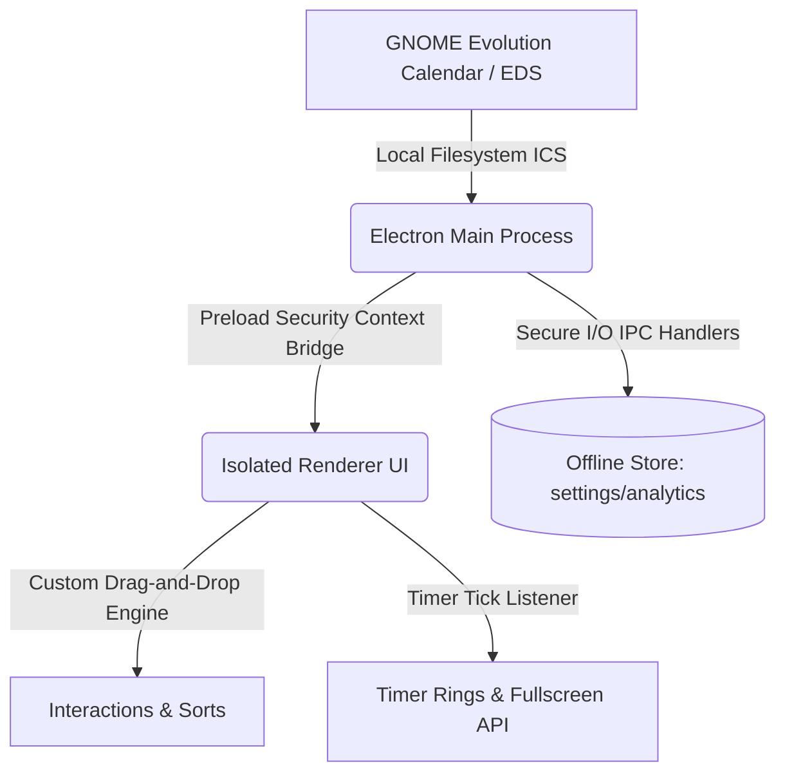

# TRACK IT

[](https://opensource.org/licenses/MIT)
[](https://nodejs.org/)
[](https://www.gnome.org/)
[](https://www.electronjs.org/)

**TRACK IT** is a high-performance, context-isolated desktop time-tracking and productivity workspace engineered specifically for Linux running the GNOME Desktop environment. 

The application establishes a secure, non-destructive bridge to the system's Evolution Data Server (EDS), allowing developers and power users to synchronize their local calendars, customize task schedules using a custom pointer-event drag-and-drop sorting engine, evaluate performance analytics via Chart.js, track streak habits, and work without interruption using an automated distraction-free fullscreen timer.

---

## 🏗️ System Architecture & Security Model

TRACK IT is architected with security and stability at its core, strictly adhering to Electron's security best practices, including context isolation and sandbox enforcement.



### Context Isolation & Restricted IPC Protocol
The renderer process runs in an isolated context and has no direct access to Node.js APIs or system resources. Communication with the Main process occurs exclusively via a secure context bridge (`window.tracker`) that exposes restricted, parameter-validated IPC channels:

| Module | Exponent Interface API | Main Process Backend Action |
| :--- | :--- | :--- |
| **System** | `minimize()`, `maximize()`, `close()` | Safe window management with native title bar bindings. |
| **Calendar** | `getCalendarEvents()`, `getCalendars()` | Parses local Evolution Data Server `.ics` directories. |
| **Tasks** | `getTasks()`, `saveTask()`, `deleteTask()` | Serializes task objects, duration estimates, and completions. |
| **Projects** | `getProjects()`, `saveProject()`, `deleteProject()` | Coordinates task lists into custom project accordion swimlanes. |
| **Habits** | `getHabits()`, `saveHabit()`, `deleteHabit()` | Manages monthly habits state matrices and streak calculations. |
| **Analytics** | `getSessions()`, `getAllSessions()`, `getAnalytics()` | Reads tracking history and calculates performance analytics. |
| **Timer** | `startTimer()`, `pauseTimer()`, `resumeTimer()`, `stopTimer()` | Drives the precision backend stopwatch interval. |
| **Resets** | `resetTrackingData()`, `resetSessions()` | Clears database fields inside targeted scopes. |

---

## 🚀 Core Engineering Features

### 1. Evolution Data Server (EDS) Synchronization
*   **Active Directory Watcher**: Implements an `fs.watch`-based filesystem observer mapping local Evolution Calendar locations (`~/.local/share/evolution/calendar/`).
*   **Non-Destructive Parsing**: Reads `.ics` data streams and normalizes them into structured JSON arrays without mutating native calendar database states.
*   **Automatic Live-Reload**: Automatically triggers a background sync to re-render views whenever changes are saved in the system GNOME Calendar app.

### 2. Zero-Dependency Pointer Drag-and-Drop Engine
*   **Bypassing WebView Constraints**: Replaces heavy external drag libraries with a lightweight pointer-event mechanism designed for smooth execution inside Chromium.
*   **Jitter Suppression (5px Threshold)**: Deferring active drag transformations until pointer movement exceeds `5px` ensures that simple mouse clicks to select tasks or check items register instantaneously without starting accidental drag states.
*   **Accurate Float Layout & Placeholders**: Calculates real-time bounding boxes (`getBoundingClientRect`) to float items fixed over a dynamically generated placeholder matching parent layout widths.
*   **Click-Capture Hijack**: Intercepts the capture phase on drag completion to stop the propagation of subsequent `click` events, ensuring reordered items aren't accidentally checked, edited, or clicked on mouse release.
*   **Cross-Page Custom Ordering**: Persists visual sequence indices in the database (`taskOrder` key) to apply identical scheduling arrangements across the Homepage (Dashboard today's schedule), Schedule list, and Timer task selector.

### 3. Distraction-Free Fullscreen Timer Mode
*   **Automated Transition**: Activates immediately when a task timer is started or resumed from the Timer page or a task card shortcut.
*   **Native Screen Management**: Leverages the HTML5 Fullscreen API (`requestFullscreen()`) to transition the application window into an immersive workspace.
*   **Premium Glassmorphic Aesthetics**: Overlays a blur backdrop (`backdrop-filter`) rendering only the large ticking timer digits (styled with pulsating text-shadow glows) and the active task title.
*   **Esc-to-Exit Escapement**: Combines global key listeners for `Escape` and `fullscreenchange` events to seamlessly exit full-screen back to standard app panels while the stopwatch continues running in the background.

### 4. Differentiated Data Erasure Scopes
The reset engine divides data clearance actions into two custom operations, avoiding unnecessary workspace destruction:
*   **Schedule & Dashboard Reset (`resetTrackingData`)**: Completely purges manual tasks, custom task durations, completions, session histories, and drag orders.
*   **Timer & Analytics Reset (`resetSessions`)**: Clears analytical session history and resets active accumulated task durations back to 0, leaving manual tasks, project structures, and custom list order intact.

### 5. Habit Track Streaks & Completion Matrix
*   **Day-Circle Cycle Machine**: Implements a three-state transition matrix (`Unset → Completed/Green → Failed/Red → Unset`) bound to calendar days.
*   **Analytics Calculation**: Dynamically updates streaks, calculates month-to-month completion rates, and displays status widgets in a visual calendar grid.

---

## 🛠️ Technical Specifications

### Tech Stack
*   **Runtime Shell**: Electron (Secure Sandbox Framework)
*   **UI/UX Design**: Vanilla Semantic HTML5, CSS Variables, Glassmorphic Styling System
*   **Graphics & Visualization**: Chart.js
*   **Data Parsing**: `node-ical`
*   **Localized DB**: `electron-store` (Offline file-based key-value storage)

### Exit Protection (Session Auto-Save)
The Main process intercepts the `close` window event to check if the timer service is active. If true, it automatically calls a synchronous stop hook to finalize elapsed milliseconds and saves the active session logs to the database, ensuring zero progress loss on application shutdown.

---

## 📁 Project Directory Structure

```
tracker/
├── package.json          # Package manifests and execution scripts
├── README.md             # Project documentation (Resume grade)
├── LICENSE               # MIT License
├── scripts/
│   └── install-desktop.js # Dynamic GNOME shortcut entry generator
└── src/
    ├── main.js           # Electron main process entry point (IPC, Timer Service)
    ├── preload.js        # Secure IPC bridge isolating Main context APIs
    ├── services/
    │   ├── calendar-service.js  # Read-only GNOME Calendar/ICS integration
    │   ├── tracking-service.js  # Settings databases operations & analytics
    │   └── timer-service.js     # High-precision timer interval engine
    └── renderer/
        ├── index.html    # Single Page Application HTML structure
        ├── styles.css    # Unified stylesheet imports loader
        ├── app.js        # Controller layer initializing UI binds and syncs
        ├── state.js      # Global state stores & setters
        ├── utils.js      # Timing formatting & date calculators
        ├── icon.png      # High-res gradient timer application logo
        ├── components/   # Modular UI widgets
        │   ├── confirm-dialog.js # Differentiated reset scope prompts
        │   ├── drag-drop.js      # Pointer-event reordering engine
        │   ├── modals.js         # Edit forms & estimates controllers
        │   └── task-item.js      # Dynamic task elements renderer
        ├── views/        # Panel-specific UI controllers
        │   ├── analytics.js
        │   ├── dashboard.js
        │   ├── habits.js
        │   ├── projects.js
        │   ├── schedule.js
        │   └── timer.js
        └── styles/       # Modular styling definitions
            ├── base.css
            ├── layout.css
            ├── glass.css
            ├── buttons.css
            ├── modals.css
            ├── task-item.css
            ├── habits.css
            └── ... (view-specific stylesheets)
```

---

## 📥 Installation & Setup

### Prerequisites
*   **Node.js**: >= v24.18.0
*   **npm**: >= v11.16.0
*   **Evolution Data Server**: Pre-installed on major GNOME Linux distributions (Ubuntu, Fedora, Debian).

### Installation Steps

1. **Clone the repository**:
    ```bash
    git clone https://github.com/abdullahsamir74/progress-tracker.git
    cd progress-tracker
    ```

2. **Install Dependencies**:
    Allows Electron's post-installation setup script to run securely.
    ```bash
    npm install --allow-scripts
    ```

---

## 🖥️ Running the Application

*   **Standard Execution**:
    ```bash
    npm start
    ```
*   **Development Sandbox** (launches the app alongside Chromium DevTools):
    ```bash
    npm run dev
    ```

---

## 🏷️ GNOME Desktop Launcher Integration

To pin and launch TRACK IT natively from your GNOME dock:

1. **Build and register the launcher**:
    ```bash
    npm run install-desktop
    ```
    This script programmatically resolves the system's Node location, builds a custom `.desktop` entry pointing to the app's root assets and launcher paths, and places it inside `~/.local/share/applications/`.

2. **Pin to Favorites**:
    *   Press the **Super** key to open GNOME Activities.
    *   Search for **"TRACK IT"**.
    *   Right-click the custom icon and select **Add to Favorites** / **Pin to Dash**.

---

## 📄 License

This project is licensed under the MIT License. See the [LICENSE](LICENSE) file for details.
