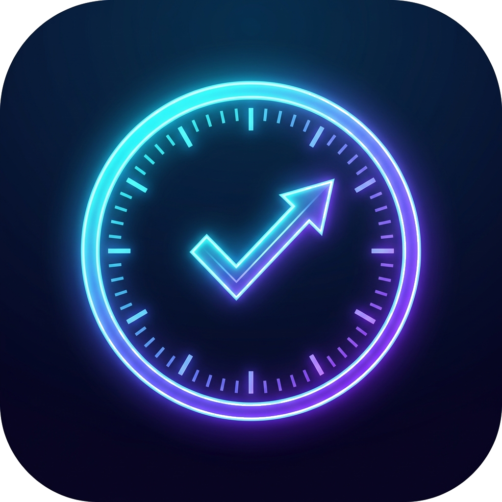

# TRACK IT

<p align="center">
  
</p>

<p align="center">
  <strong>A modern, privacy-first desktop time tracker and productivity suite built natively for Linux (GNOME).</strong><br>
  <em>Integrates seamlessly with GNOME Calendar via Evolution Data Server to bring your schedule, tasks, focus sessions, projects, and habits into one unified workspace.</em>
</p>

<p align="center">
  
  
  
  
  
</p>

---

## 🌟 Overview

**TRACK IT** is a native Linux productivity and time-tracking application designed specifically for the GNOME desktop environment.

It bridges the gap between your system calendar and your daily focus workflow by syncing directly with **GNOME Calendar (Evolution Data Server)**, allowing you to track time against scheduled meetings, plan tasks, log deep work sessions with a dual-mode focus timer, organize projects, and maintain daily habits.

All your data is stored **100% locally** in a high-performance SQLite database on your machine. No cloud synchronization, no remote accounts, and zero telemetry.

---

## ✨ Features

### 📅 Native GNOME Calendar Integration
- **Evolution Data Server (EDS)**: Automatically discovers and synchronizes scheduled events from GNOME Calendar in real time.
- **Auto-Sync File Watcher**: Automatically detects and reflects calendar additions, edits, and deletions without manual refreshes.
- **Bi-Directional Workflow**: Track time directly against your calendar events or create independent manual tasks.

### 📝 Task Management & Rich Task Notes
- **Comprehensive Task Tracking**: Set task names, scheduled start dates, priorities (`High`, `Medium`, `Low`), time estimates, and project associations.
- **Rich Task Notes**: Attach multi-line notes, checklists, links, or instructions to any task.
- **Quick Notes Modal**: View and edit task notes from any view with a single click.
- **Visual Note Badges**: Tasks with notes display an accent badge and hover tooltip preview.
- **Flexible Sorting**: Sort tasks by custom manual drag-and-drop order, scheduled start time, or priority level.

### ⏱️ Focus Timer & Pomodoro Mode
- **Dual Tracking Modes**:
  - **Stopwatch Mode**: Open-ended count-up tracking with active progress and estimate gauge.
  - **Pomodoro Mode**: Structured interval tracking with focus presets (`25m / 5m`, `50m / 10m`, `15m / 3m`) and phase tracking (*Focus Session*, *Short Break*, *Long Break*).
- **HUD Task Notes Card**: Displays the active task's notes directly on the timer screen during work sessions with a quick-edit button.
- **Distraction-Free Fullscreen Mode**: Auto-engaging fullscreen timer view with large tabular digits and escape controls.
- **Visual Countdown Ring**: Smooth SVG progress ring with phase-adaptive color accents.
- **Audio Chime Alerts**: Subtle sound cues when focus phases complete or timers stop.
- **Crash Recovery**: Active timer sessions automatically save if the application closes unexpectedly.

### 📊 Time Logs & Manual Session Entry
- **Session History**: Detailed searchable, filterable log of all completed time entries and focus sessions.
- **Manual Work Logger**: Easily log past work sessions that occurred away from your desk with custom date/time, duration, notes, and project assignment.
- **Inline Editing & Deletion**: Modify durations or remove redundant sessions anytime.

### 📁 Projects & Weekly Targets
- **Color-Coded Projects**: Organize tasks and tracked hours into customizable projects with dedicated color tags.
- **Weekly Target Hours**: Set weekly goal hours for each project and monitor real-time completion progress bars.
- **Unassigned Task Pool**: Easily triage unscheduled tasks and assign them to projects via drag-and-drop or select menus.

### 🎯 Daily Habit Tracker
- **Monthly Check-Off Matrix**: Track daily routines and habits across an interactive monthly grid.
- **Streak Calculation**: Automatically computes consecutive active streaks and completion rates.

### 📈 Productivity Analytics & Heatmap
- **Weekly Distribution**: Dynamic bar charts visualizing daily tracked hours across the current week.
- **Project Breakdown**: Comparative metrics showing where your time was invested.
- **Yearly Contribution Heatmap**: GitHub-style activity grid highlighting your focus intensity throughout the year.
- **Live Streak Badge**: Live streak badge in the sidebar tracking consecutive active days with logged focus time.

### 🎨 Design & Custom UI
- **Glassmorphism Design System**: Modern translucent backdrops, glowing accents, and smooth transitions.
- **Custom Popover Pickers**: Handcrafted date and time pickers featuring digital clock displays, month navigation, 12-hour/minute selector grids, stepper controls, and quick presets (`Now`, `+15m`, `+30m`, `+1h`).
- **Dark & Light Themes**: Instant theme toggle accessible from the titlebar.

### 🔒 100% Offline & Local SQLite Storage
- **High Performance**: Powered by `better-sqlite3` with Write-Ahead Logging (`WAL`) mode for instantaneous queries.
- **Automatic Schema Migrations**: Safe, non-destructive schema migrations ensure existing databases upgrade seamlessly.
- **Backup & Portability**: Export your complete database to JSON, import backups, or perform scoped data resets from **Settings**.

---

## ⌨️ Keyboard Shortcuts

Control your workspace efficiently without leaving the keyboard:

| Shortcut | Action | Description |
| :--- | :--- | :--- |
| <kbd>Ctrl</kbd> + <kbd>N</kbd> / <kbd>Cmd</kbd> + <kbd>N</kbd> | **Quick Add Task** | Opens the task creation modal from any view |
| <kbd>Spacebar</kbd> | **Toggle Timer** | Starts, pauses, or resumes the active focus timer |
| <kbd>Ctrl</kbd> + <kbd>1</kbd> .. <kbd>9</kbd> | **Dynamic View Switcher** | Dynamically jumps to the $N^{\text{th}}$ sidebar tab (Dashboard, Schedule, Calendar, Focus Timer, Time Logs, Projects, Habits, Analytics, Settings) |
| <kbd>Esc</kbd> | **Dismiss / Exit** | Closes active modals, date/time popovers, or exits fullscreen timer mode |

---

## 🛠️ Tech Stack & Architecture

- **Runtime**: [Electron 35](https://www.electronjs.org/)
- **Database**: [SQLite 3](https://www.sqlite.org/) via [`better-sqlite3`](https://github.com/WiseLibs/better-sqlite3)
- **Calendar Parsing**: [`node-ical`](https://github.com/jens-maus/node-ical) + GNOME Evolution Data Server (`~/.local/share/evolution/calendar`)
- **Frontend**: Vanilla ES Modules, Semantic HTML5, and CSS Design System (Zero Heavy Frameworks)

---

## 🚀 Getting Started

### Prerequisites

- **Linux OS** with **GNOME Desktop Environment** (for GNOME Calendar integration)
- **C/C++ Build Tools**: `sudo apt install -y build-essential` (required for native modules like `better-sqlite3`)
- **Node.js** `>= v20.0.0` (v24 LTS recommended)
- **npm** `>= v10.0.0`

### Installation

1. **Clone the repository:**
   ```bash
   git clone https://github.com/abdullahsamir74/TRACK-IT.git
   cd TRACK-IT
   ```

2. **Install dependencies:**
   ```bash
   npm install
   ```

3. **Launch the application:**
   ```bash
   npm start
   ```

4. **Launch in development mode (with DevTools):**
   ```bash
   npm run dev
   ```

---

## 🖥️ Desktop Integration (GNOME Dock / App Launcher)

To register **TRACK IT** with your system application launcher and pin it to your GNOME Dock:

1. Run the desktop installer script:
   ```bash
   npm run install-desktop
   ```
2. Press <kbd>Super</kbd> (Windows key), search for **TRACK IT**, right-click the application icon, and click **Add to Favorites** / **Pin to Dash**.

---

## 🗄️ Database Inspection

Your SQLite database file is stored locally at:

```bash
~/.config/track-it/tracker.sqlite
```

You can query your data at any time via the command line or using a visual viewer like `sqlitebrowser`:

```bash
# View all tasks directly from terminal
node -e "const db = require('better-sqlite3')(require('os').homedir() + '/.config/track-it/tracker.sqlite'); console.table(db.prepare('SELECT id, name, notes, status, priority FROM tasks').all());"

# View recent tracked time entries
node -e "const db = require('better-sqlite3')(require('os').homedir() + '/.config/track-it/tracker.sqlite'); console.table(db.prepare('SELECT task_name, duration_minutes, start_time FROM time_entries ORDER BY start_time DESC LIMIT 10').all());"
```

---

## 📄 License

Distributed under the **MIT License**. See [`LICENSE`](LICENSE) for details.
